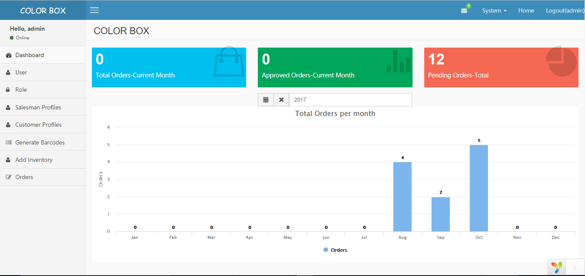
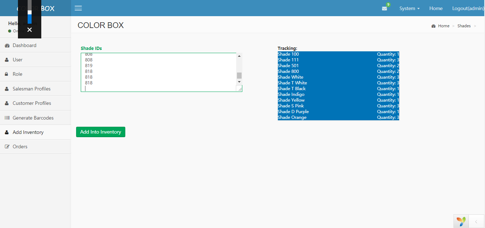
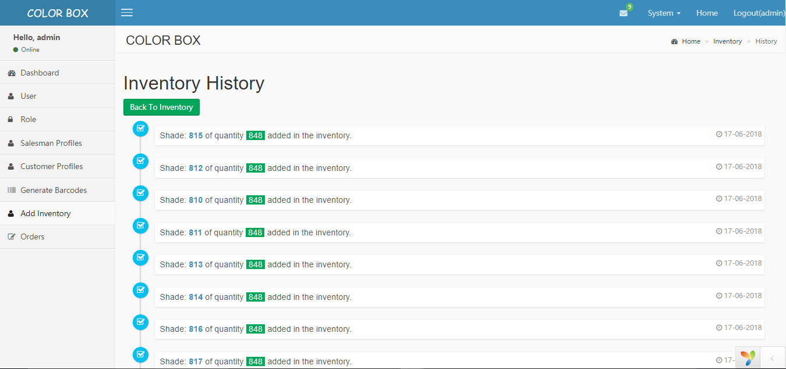
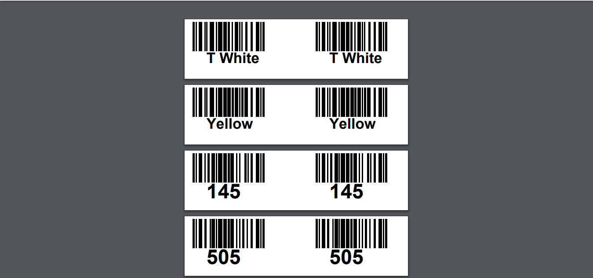
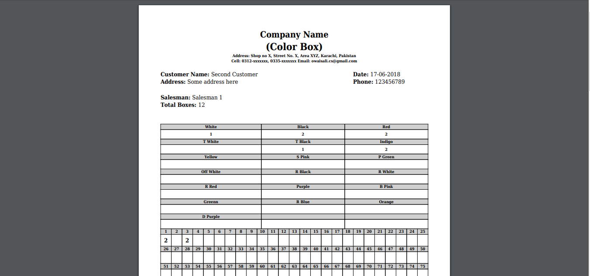
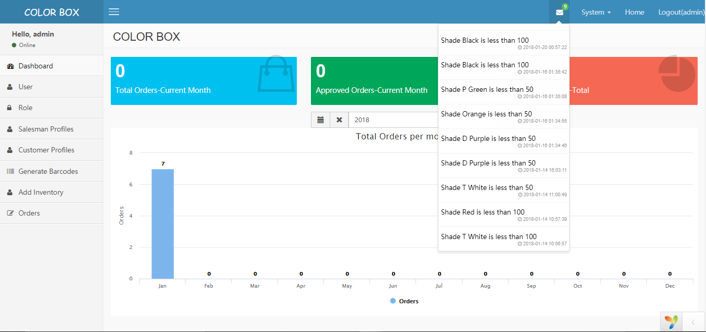

# COLORBOX-Inventory Management System
----
**COLORBOX** is an Inventory Management System for managing the sales of boxes of cloth's threads/shades using Barcode technology. This project can generate and scan **Code128 Barcodes** labels.

### Features!
This project has the following features/functionalities:

* It manages customers, salesmen and orders from pending to delivery status
* It can generate multiple barcodes on a single click just by entering the quantity
* An interactive way to add, retrieve and track history of the inventory
* On Dashboard, it shows the number of pending orders of current month
* It shows the progrss of orders delivered on yearly basis for the management level purposes.
* It also sends a notification when a shade quantity drops from a defined limit which can be removed by clicking on it

This project uses the following technologies:

1.  PHP 5.6 with Yii 2 Framework
2.  A 1-D Scanner and a GK88t Zebra Printer with kit
3.  MySQL database server
4.  AdminLTE/Bootstrap on Frontend
5.  Javascript
6.  JQuery
7.  AJAX
8.  Libraries/Extensions/Helpers of Yii 2 including ArrayHelper, mpdf class, chartjs, gii, datetimepicker, swiftmailer etc.

### Snapshots
Dashboard : 
Adding Inventory : 
Inventory History : 
Barcode Labels PDF: 
Packing List : 
Notifications : 

### Pre-requisites

This project works fine with:
PHP version 5.6.30
Yii2 version 2.0.15.1 and 
10.1.21-MariaDB

## Getting Started:
1. Clone this repository by `git clone https://github.com/owaisalics/coloboxInventorySystem.git` 
2. Change the db name in `common/config/main-local.php`
3. Run `yii migrate` or run SQL file named db-file.sql located in db directory 
4. Run `composer install` in the root directory to install the required libraries.
5. Go to `localhost/directory_name/backend/web`
6. Enjoy!

### Roles:
#####  1. Inventory Operator
* He can generate/print the barcode labels using **GK888t Zebra Printer** to paste on the threads/shades boxes.
* He can scan those boxes to enter the items in the inventory.
* He can view the history of inventory in and out dates.

##### 2. Order Operator/Salesman
* Order Operator can create orders for customers with Pending Status.
* Order Operator can pack the order by scanning out inventory items using **linear barcode scanner** and send the request to admin for approval.
* Order Operator can print the Packing List in PDF which is sent with the order of customer and is signed by the customer as acknowledgement.

##### 3. Admin
* Admin can do everything which Inventory Operator and Order Operator can do.
* Admin can also approve the order for dispatching.
* Admin can mark the order as delivered on acknowledgement from customer.
* Admin can add new Salesman and Customers in the system.
* Admin can cancel orders.

Login Credentials
-----------------
You can use following credentials to login for different roles:

Admin Username: `admin`
Password: `admin`

Inventory Operator Username: `inventory_operator`
Password: `inventory_operator`

Order Operator Username: `order_operator`
Password: `order_operator`

Comments, complaints or suggestions are appreciated.

----

By, [Owais Ali](https://github.com/owaisalics)
